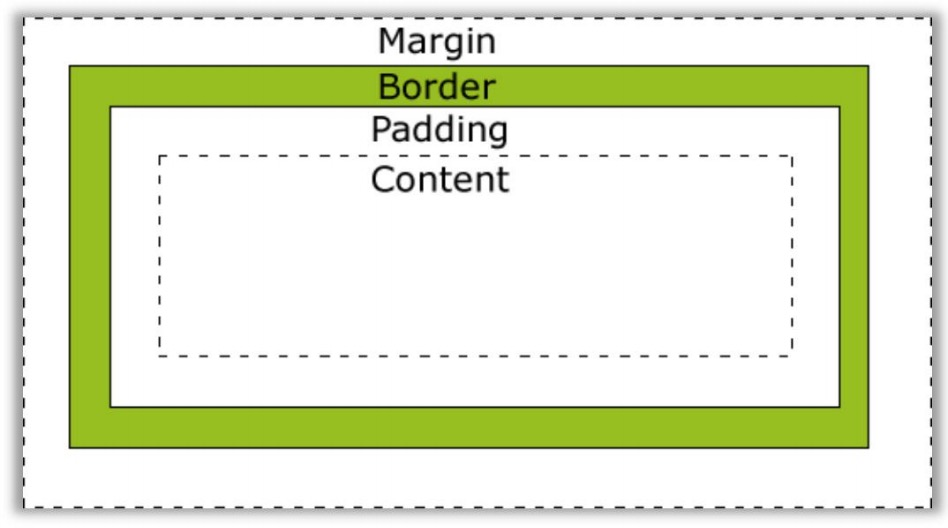
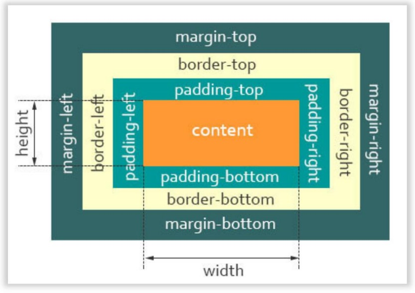
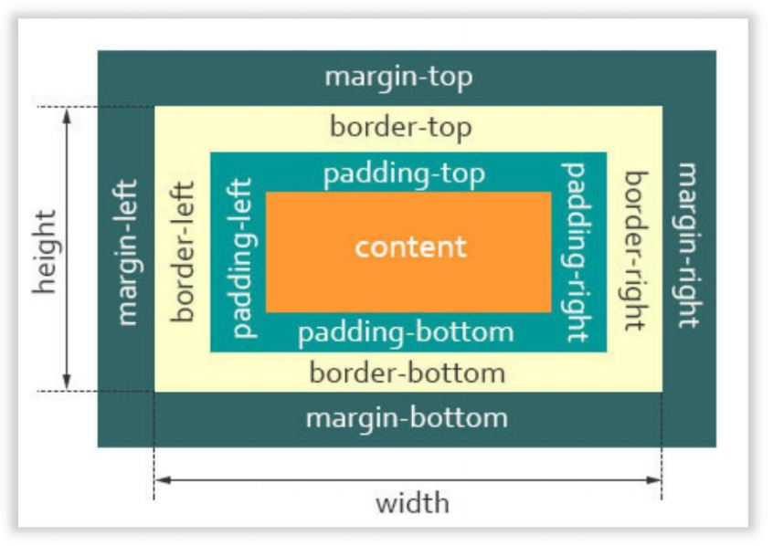

# 考点二：关于盒模型

### 1.请说出你对盒模型的理解

我们可以把页面上所有的 html 元素都可以看作是盒子，也就是说整个 html 页面就是由无数个盒子 通过特定的布局结合在一起的。

每个盒子由 4 部分构成：外边距 margin、内边距 padding、内容 content、边框 border。如下图：

而目前市面上存在 2 中盒模型：`标准盒模型` 和 `IE 盒子模型`，它俩对计算宽度和高度的不同。

先说标准盒模型，也就是 W3C 规定的盒子模型。

在标准模式下：

1. 盒子总宽度 = width + padding + border + margin。
2. 盒子总高度 = height + padding + border + margin。

也就是（划重点啦!!!!）我们设置的 width/height 只是内容 content（上图橙色的部分）的宽/高度，不包 含 padding 和 border 值 。

反过来，我们再看看 IE 盒子模型，又称怪异盒模型。

在 IE 盒子模型下：

1. 盒子总宽度 = width+ margin = (内容区宽度 + padding + border) + margin。
2. 盒子总高度 = height + margin = (内容区高度 + padding + border) + margin。

也就是我们设置的 width/height 包含了 padding 和 border 值（如上图橙色+浅绿色+黄色三部分）。

总结： `标准盒子模型和 IE 盒子模型的差别就在于宽度和高度包含的范围不同`

CSS3 新增了 `box-sizing` 属性，它可以让开发者指定盒子模型种类。

1. 值为 content-box：padding 和 border 不算在我们设置的 width/height 里面。也就是说，指定盒子模型为 标准盒模型。

2. 值为 border-box：padding 和 border 算在了我们设置的 width/height 里面。也就是说，也就是指定盒子 模型为 IE 盒子模型。
