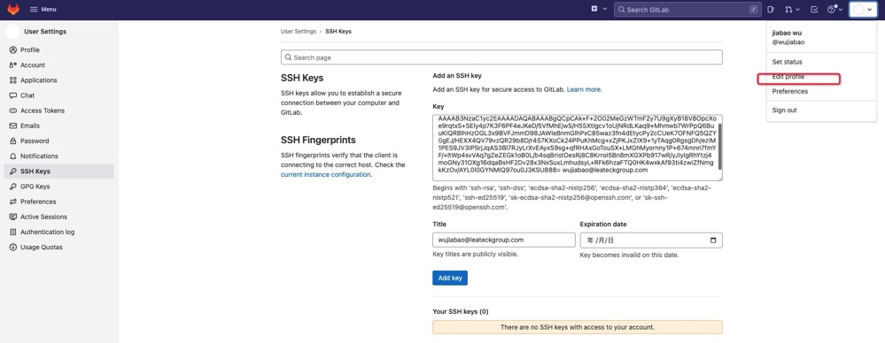

# mac git 如何配置ssh


### 1.git配置

1. 打开git命令窗口

2. 配置用户名

```js
git config --global user.name "wujiabao"
```

3. 配置用户邮箱

```js
git config --global user.email "wujiabao@leateckgroup.com"
```


4. 生成公钥、密钥（填自己的邮箱，执行后需要按几次 enter 直到结束）

```js
ssh-keygen -t rsa -C "wujiabao@leateckgroup.com"
```

5. 配置ssh变量

```js
git config --global ssh.variant ssh
```

### 2.gitlab配置公钥

1. 打开公钥存放地址

```js
cd ~/.ssh
```

2. 复制公钥文件内容，公钥文件名id_rsa.pub

3. 登陆gitlab 将生成的公钥添加ssh

