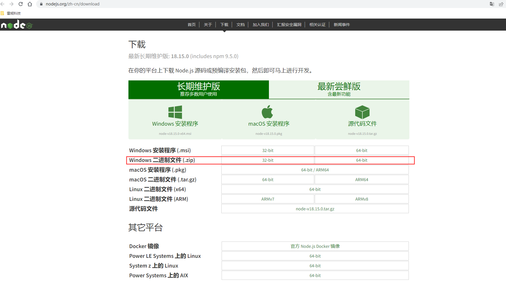

# WINDOW系统下配置环境变量

## 1.进入nodejs官网下载node zip安装包



## 2.解压缩nodejs文件

将nodejs文件解压到对应的目录，自定义路径，比如D:/nodejs

## 3.自定义环境变量 需要重启

修改环境变量配置使node可以在任何命令行下执行

在用户变量下新增 
1. key:`NODE_PATH` value:`D:\nodejs`
2. key:`PATH` value: `%NODE_PATH%、%NODE_PATH%\node_global`

## 4.在nodejs目录下新建两个文件

新增两个文件 存储node缓存以及node全局数据

```js
npm config set cache "D:\nodejs\node_cache"
npm config set prefix "D:\nodejs\node_global"
```

