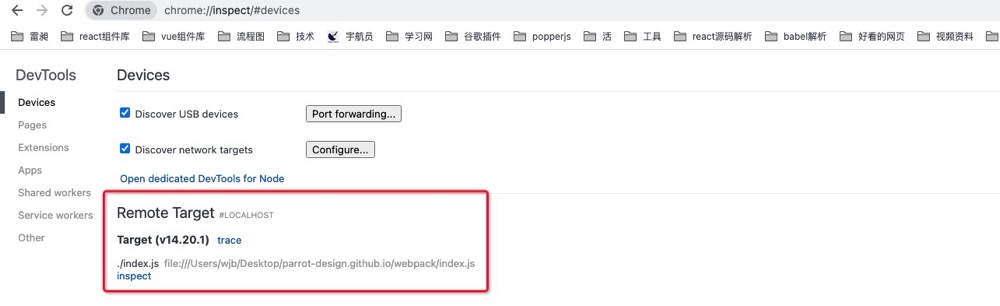
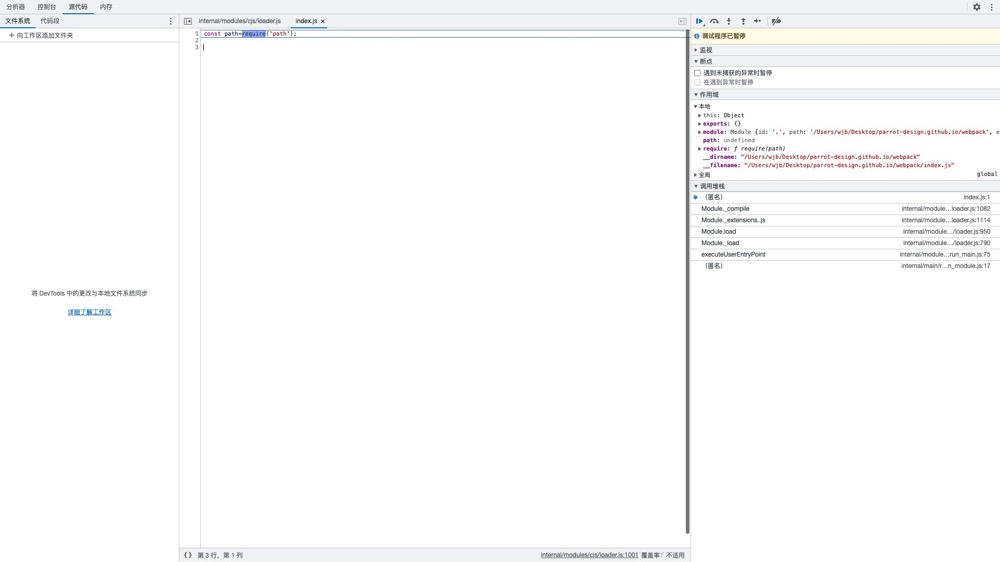

# 如何调试webpack源码

想必大部分前端都会使用

### 1.调试node脚本

#### 第一步：写一个普通js文件

```js
//index.js
const path=require('path');
```

#### 第二步：在终端中输入执行命令

```js
node --inspect-brk ./index.js
```

#### 第三步：在谷歌浏览器地址栏中输入chrome://inspect 回车 进入以下页面



#### 第四步：点击Remote Target中的inspect，进入调试页面


 

### 2.调试webpack源码

#### 第一步：初始化配置文件

```js
npx webpack-cli init
```

如果使用该命令 他会提示你是否安装@webpack-cli/generators 选择合适自己的配置 一路回车安装就好 

#### 第二步：输入打包命令，进行打包

```js

```